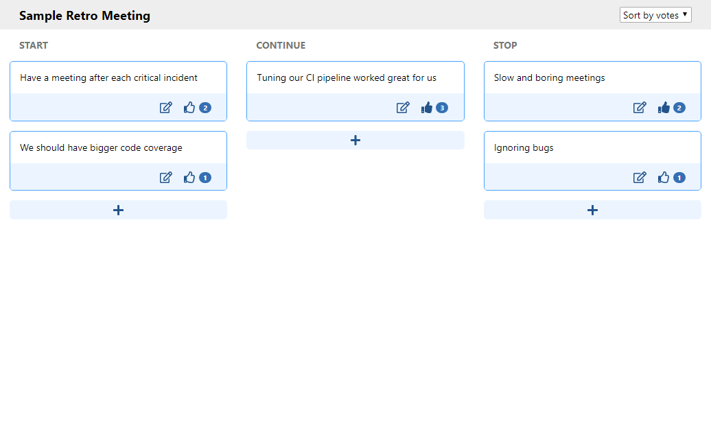

<h1> 
   
  Miniretro 
  <a href="https://travis-ci.org/misostc/miniretro"></a>
</h1>

A simple web app for your retrospective meeting.

This app aids in creating a board where you and your colleagues can write notes of the retrospective meeting and give each other likes. The edits are in real-time updated in everyone's browser.



## How to use

You can deploy this app via the built docker image on [Docker hub](https://hub.docker.com/r/misostc/miniretro). Since it is a Spring boot application, you can include configuration as you wish by including file `application.properties`.

The simplest solution is to use docker-compose which will run both app and postgres database:

```yml
version: "3"

volumes:
  database_data:

services:
  database:
    image: postgres:11-alpine
    restart: always
    environment:
      POSTGRES_PASSWORD: miniretro
    volumes:
      - database_data:/var/lib/postgresql/data
  web:
    image: misostc/miniretro:latest
    restart: always
    environment:
      - SPRING_PROFILES_ACTIVE=production
    ports:
      - 80:8080
    depends_on:
      - database
```

## Notes

* I am not responsible for any problems caused by this app.
* I did not design this with any security in mind, anyone can do anything in this app

## Contribute

I welcome contributions, just note that I was learning React as I was building this so it may not be the best.
